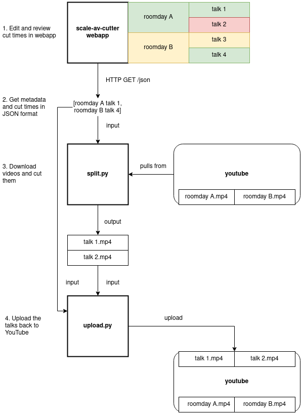

scale-av-cutter tools
===

These are scripts that will take the output from the scale-av-cutter Flask app
and actually perform video downloading and post-processing.

Here is the post-processing flow:



Dependencies
---

These tools do not require a server to run, and they have dependencies
independent of those of the main scale-av-cutter Flask app.

Make a new virtualenv, and install the stuff in the requirements.txt.

```
python3 -m venv venv
source venv/bin/activate
pip install --update -r requirements.txt
```

***Note***: You also need the `ffmpeg` executable installed on your system. Please
install it via your system package manager, or compile it yourself and expose
it in PATH.

split.py
---

This script uses the output from the scale-av-cutter app's **/json** endpoint
to download the full day streams from Youtube, and then cut them up into talk
videos based on the timestamps. e.g.:

```
curl -s "$SCALE_AV_CUTTER_URL/json" -b "password=$ADMIN_PASSWORD" > talks.json
./split.py talks.json
```

By default, you'll end up with the roomday videos and cut talks inside
`workdir/`.

Run it with -h to see additional options.


upload.py
---

This script uploads the videos generated by split.py to a user's Youtube
account.

By default, videos will be uploaded as unlisted. It uses the talk metadata in
the webapp JSON output to determine what title/description to upload the
videos with. The description it creates looks like:

```
{speakers}

{url to talk in SCaLE website}

{talk description}
```

You can also manually add a `youtube_title` and `youtube_description` fields
into specific talks in the JSON, that will be used for uploading to YouTube.

### Usage

Start by just trying to run the script:

```
./upload.py talks.json
```

It won't succeed the first time, because interacting with Google's API is
unfortunately not straightforward. The script will tell you what you're
missing. At a high level:

1. Make sure the talk title/descriptions follow [YouTube's
   restrictions](https://developers.google.com/youtube/terms/required-minimum-functionality#data-requirements).
   The script will tell you which talks fail this validation, and you will need
   to hand-edit the JSON to fix it (e.g. override with `youtube_title`).

2. Obtain a `client_secrets.json`. This is used by the script to **authenticate
   itself to Google**, so they can track request quota and other things. I
   can't commit one here, or it'll be abused and rescinded, so you must obtain
   one out-of-band. You can either:

   1. Ask a SCaLE AV maintainer for a client secrets file. The maintainer will
      also need to add your account (email address) as a "test user" of the
      client, so the script can be permitted to upload on your behalf.

   2. Request your own API client. See [Creating a Client](#creating-a-client) below.

3. Follow the script's instructions to **authorize an account for it to upload
   videos to**. The script will link you to an OAuth page where you should
   login. If you used the SCaLE AV maintainer's client secrets, this should be
   the same account you told them to authorize. After logging in, you'll get a
   code that you'll paste in the script.

### Creating a Client

You can use any account for this. It doesn't have to be the account you're
going to upload videos to.

1. Go to [Google Console](https://console.developers.google.com/)

2. Click "CREATE PROJECT". Name it whatever you want. Confirm.

3. Go to "Library" in the left-hand bar. Search "youtube data". Go to its page,
   and click "ENABLE".

4. Go to "OAuth consent screen" in the left-hand bar. Select "External", and
   follow the registration process:

   1. Enter whatever app name you want, and whatever emails you want.

   2. In the Scopes page, add the Youtube Data API v3, "youtube.upload" scope.

   3. In the Test users page, add the email address of the account you want to
      upload videos to.

   4. Click "back to dashboard" in the confirmation page.

4. Go to "Credentials" in the left-hand bar. Click "CREATE CREDENTIALS" ->
   Create OAuth client ID. Application type is "Desktop app". Name it whatever.

5. Now, in the Credentials page you can click the little download button in the
   right side of your OAuth client entry, and then click "DOWNLOAD JSON".

That gets you a valid-ish `client_secrets.json`, but if only that was all there
is to it. As of 2022-10-02, I know if these gotchas:

1. Clients created after 2022-07-28 [need to be
   audited](https://developers.google.com/youtube/v3/revision_history#release_notes_07_28_2020)
   otherwise the videos they upload will be locked. This audit process may
   take up to a week. Start now if you want to use your own client.

2. Clients have [quota
   limits](https://developers.google.com/youtube/v3/getting-started#quota). New
   clients only start out able to attempt to upload like 6 videos. To request a
   higher quota, you need to go to the same [audit
   form](https://support.google.com/youtube/contact/yt_api_form) except put in
   a "quota extension request".

3. Google has [restricted the
   "out-of-band"](https://developers.googleblog.com/2022/02/making-oauth-flows-safer.html#instructions-oob)
   auth flow, except to clients that still have a "Testing" publishing status.
   This requires you to explicitly allow accounts that authorize against your
   client, by adding them as test users. You can also try going through the
   full publishing process for your app, but it's an insane PITA for a script.
